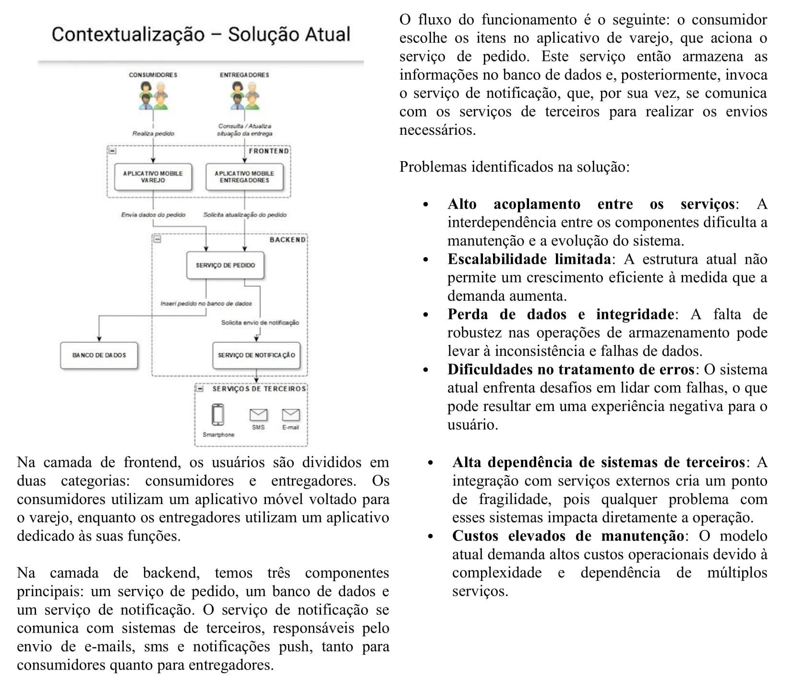
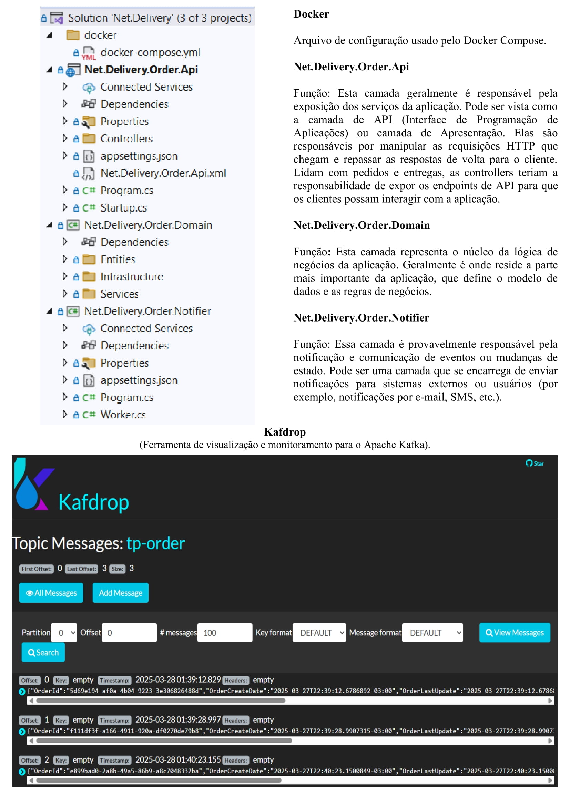

# Kafka Avançado

<p align="justify"> 
Desenvolvimento de uma aplicação prática que implementa a arquitetura proposta, utilizando o Apache Kafka em conjunto com o framework .NET Core. O foco está na integração do Kafka com aplicações .NET Core, abordando a implementação de produtores e consumidores de mensagens para possibilitar uma comunicação assíncrona e distribuída.
</p> 

## 🛠️ Construído com 

* [Visual Studio Code](https://code.visualstudio.com/) - Editor de código-fonte leve e de código aberto da Microsoft, que oferece uma experiência de desenvolvimento poderosa e altamente personalizável, embora seja mais simples que o Visual Studio.

## 📚 Principais Bibliotecas, Frameworks e Comandos do NuGet Utilizados

* [netcoreapp3.1]() - Versão de longo prazo (LTS) da plataforma de desenvolvimento .NET, lançada pela Microsoft em dezembro de 2019. Ele permite a criação de aplicações cross-platform (multiplataforma), ou seja, pode ser executado em sistemas operacionais como Windows, Linux e macOS.

* [Confluent.Kafka]() -  Biblioteca cliente para interagir com o Apache Kafka, desenvolvida pela Confluent. Ela oferece uma maneira eficiente e robusta de conectar aplicações .NET ao Kafka, permitindo produzir e consumir mensagens de tópicos Kafka com alto desempenho e confiabilidade.

```
dotnet add package Confluent.Kafka
```

* [Swashbuckle.AspNetCore]() - Biblioteca que facilita a integração do Swagger em aplicações ASP.NET Core, permitindo gerar automaticamente a documentação de APIs RESTful. 

```
dotnet add package Swashbuckle.AspNetCore
```

## 🚧 Descrição da arquitetura da solução atual e nova solução

A estrutura da arquitetura da solução atual e nova solução segundo a imagem abaixo é composta da seguinte forma:




## 🚧 Descrição da Estrutura do Projeto

A estrutura do projeto segundo a imagem abaixo é composta da seguinte forma:



## ⚠️ Atenção 

Destinado exclusivamente para fins de estudo.

---
⌨️ por [Byron Doria](https://gist.github.com/brsdoria) 😊
