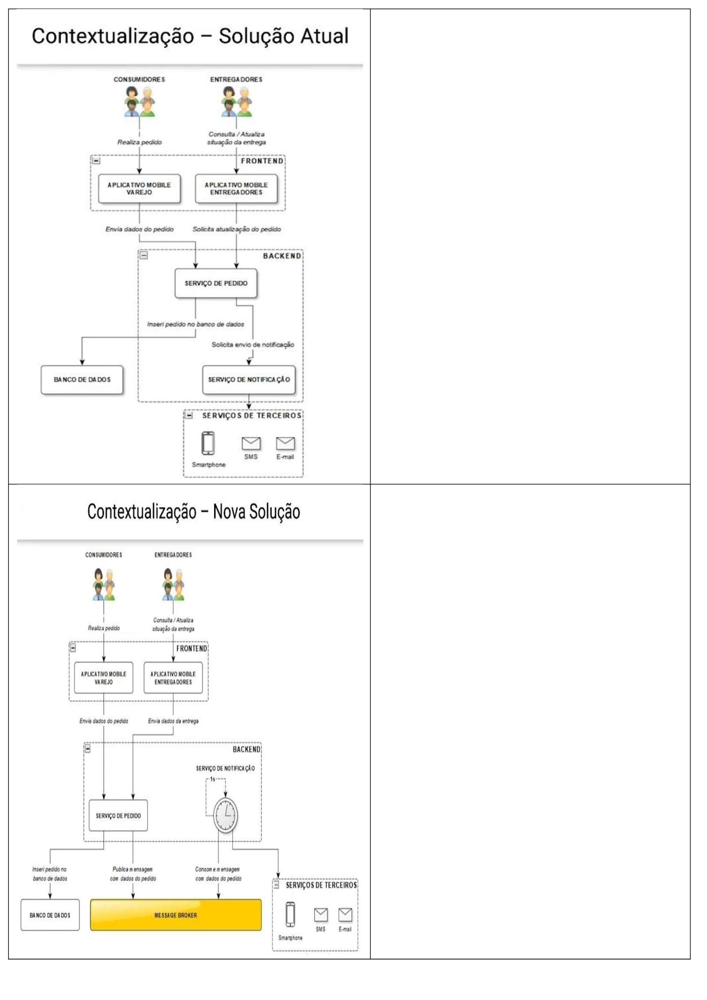

# Kafka Avançado

<p align="justify"> 
Desenvolvimento de uma aplicação prática que implementa a arquitetura proposta, utilizando o Apache Kafka em conjunto com o framework .NET Core. O foco está na integração do Kafka com aplicações .NET Core, abordando a implementação de produtores e consumidores de mensagens para possibilitar uma comunicação assíncrona e distribuída.
</p> 

## 🛠️ Construído com 

* [Visual Studio Code](https://code.visualstudio.com/) - Editor de código-fonte leve e de código aberto da Microsoft, que oferece uma experiência de desenvolvimento poderosa e altamente personalizável, embora seja mais simples que o Visual Studio.

## 📚 Principais Bibliotecas, Frameworks e Comandos do NuGet Utilizados

* [netcoreapp3.1]() - 

```

```

* [Confluent.Kafka]() -  

```
dotnet add package Confluent.Kafka
```

* [Swashbuckle.AspNetCore]() - 

```

```

* [Microsoft.Extensions.Configuration.Abstractions]() - 

```

```

* [Microsoft.Extensions.Hosting]() - 

```

```

## 🚧 Descrição da Estrutura do Cluster do Kafka

A estrutura da arquitetura da solução atual e novo solução segundo a imagem abaixo é composta da seguinte forma:



## 🚧 Descrição da Estrutura do Projeto

A estrutura do projeto segundo a imagem abaixo é composta da seguinte forma:


## ⚠️ Atenção 

Destinado exclusivamente para fins de estudo.

---
⌨️ por [Byron Doria](https://gist.github.com/lohhans) 😊
